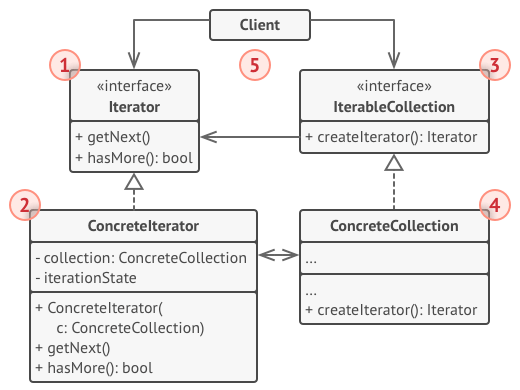
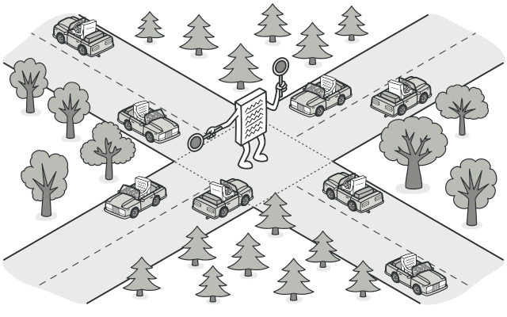
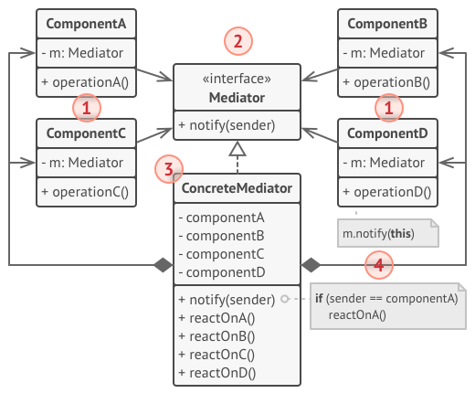

# 行为模式

​	对象间如何通讯的。

*Behavioral Pattern*是对不同对象之间***划分责任和算法***的抽象化。

 通过***行为模式***，可以更清晰地划分类与对象的*职责*，并研究系统运行时实例对象间的*交互*。

- *类行为型模式*：使用多态方式来分配父类和子类的职责。
- *对象型行为模式*：使用对象的聚合关联关系来分配行为，在软件开发中尽量用关联关系来代替继承关系。

[TOC]

## 责任链模式

### 🎈意图

​	将请求沿着处理者链进行发送，收到请求后，每个处理者均可对请求进行处理，或将其传递给链上下一个处理者。

### 🗜结构

1. **处理者** （Handler） 声明了所有具体处理者的通用接口。 该接口通常仅包含单个方法用于请求处理， 但有时其还会包含一个设置链上下个处理者的方法。

2. **基础处理者** （Base Handler） 是一个可选的类， 你可以将所有处理者共用的样本代码放置在其中。

   通常情况下， 该类中定义了一个保存对于下个处理者引用的成员变量。 客户端可通过将处理者传递给上个处理者的构造函数或设定方法来创建链。 该类还可以实现默认的处理行为： 确定下个处理者存在后再将请求传递给它。

3. **具体处理者** （Concrete Handlers） 包含处理请求的实际代码。 每个处理者接收到请求后， 都必须决定是否进行处理， 以及是否沿着链传递请求。

   处理者通常是独立且不可变的， 需要通过构造函数一次性地获得所有必要地数据。

4. **客户端** （Client） 可根据程序逻辑一次性或者动态地生成链。 值得注意的是， 请求可发送给链上的任意一个处理者， 而非必须是第一个处理者。

### 🔐适用性

🙉**当程序需要使用不同方式处理不同种类请求， 而且请求类型和顺序预先未知时， 可以使用责任链模式**。

🤳 该模式能将多个处理者连接成一条链。 接收到请求后， 它会 “询问” 每个处理者是否能够对其进行处理。 这样所有处理者都有机会来处理请求。

🙉 **当必须按顺序执行多个处理者时， 可以使用该模式。**

🤳 无论你以何种顺序将处理者连接成一条链， 所有请求都会严格按照顺序通过链上的处理者。

🙉 **如果所需处理者及其顺序必须在运行时进行改变， 可以使用责任链模式。**

 🤳如果在处理者类中有对引用成员变量的设定方法， 你将能动态地插入和移除处理者， 或者改变其顺序。

实例代码：[过滤访问]()

 本例展示了包含用户数据的请求如何依次通过处理者链来执行各种不同的行为 （例如认证、 授权与验证）。 

## 命令模式

### 🎈意图

​	将命令请求封装为一个对象，可以用不同的请求来进行参数化。

### 🗜结构

1. **发送者** （Sender）——亦称 “触发者 （Invoker）”——负责对请求进行初始化， 其中必须包含一个成员变量（`command`）来存储对于命令对象的引用。 发送者触发命令， 而不向接收者直接发送请求。 注意， 发送者并不负责创建命令对象： 它通常会通过构造函数从客户端处获得预先生成的命令。

2. **命令** （Command） 接口通常仅声明一个执行命令的方法。

3. **具体命令** （Concrete Commands） 会实现各种类型的请求。 具体命令自身并不完成工作， 而是会将调用委派给一个业务逻辑对象。 但为了简化代码， 这些类可以进行合并。

   接收对象执行方法所需的参数可以声明为具体命令的成员变量。 你可以将命令对象设为不可变， 仅允许通过构造函数对这些成员变量进行初始化。

4. **接收者** （Receiver） 类包含部分业务逻辑。 几乎任何对象都可以作为接收者。 绝大部分命令只处理如何将请求传递到接收者的细节， 接收者自己会完成实际的工作。

5. **客户端** （Client） 会`创建并配置`具体命令对象。 客户端必须将包括接收者实体在内的所有请求参数传递给命令的构造函数。 此后， 生成的命令就可以与一个或多个发送者相关联了。

### 🔐适用性

+ **如果你需要通过操作来参数化对象， 可使用命令模式。**
+ **如果你想要将操作放入队列中、操作的执行或者远程执行操作，可使用命令模式。** 
+  **如果你想要实现操作回滚功能，可使用命令模式。** 

尽管有很多方法可以实现撤销和恢复功能， 但命令模式可能是其中最常用的一种。

为了能够回滚操作， 你需要实现已执行操作的历史记录功能。 命令历史记录是一种包含所有已执行命令对象及其相关程序状态备份的栈结构。

这种方法有两个缺点。 首先， 程序状态的保存功能并不容易实现， 因为部分状态可能是私有的。 你可以使用***备忘录模式***来在一定程度上解决这个问题。

其次， 备份状态可能会占用大量内存。 因此， 有时你需要借助另一种实现方式： 命令无需恢复原始状态， 而是执行反向操作。 反向操作也有代价： 它可能会很难甚至是无法实现。

**实例代码**：[文字编辑器和撤销](./command)

​	本例中的文字编辑器在每次用户与其互动时，都会创建一个新的命令。命令执行行为后会被压入历史堆栈。

​	现在程序执行撤销操作，就需要从历史纪录中提取最近执行的命令，然后执行反向操作或者回复由该命令保存的编辑器历史状态。

## 迭代器

### 🎈意图

​	不暴露集合底层表现形式（列表、栈和树等）的情况下遍历集合中的所有元素。

>  迭代器模式的主要思想是将集合的遍历行为抽取为单独的*迭代器*对象。 

​	将每个遍历算法当作一个迭代器对象，来遍历集合元素。

### 🗜结构

1、**迭代器**（Iterator）接口声明了遍历集合所需的操作：获取下一个元素、获取当前位置和重新开始迭代等。

2、**具体迭代器**（Concrete Iterators） 实现遍历集合的一种特定算法。 迭代器对象必须跟踪自身遍历的进度。 这使得多个迭代器可以相互独立地遍历同一集合。 

3、**集合**（IterableCollection）接口声明一个或多个方法来获取与集合兼容的迭代器。 请注意， 返回方法的类型必须被声明为迭代器接口， 因此具体集合可以返回各种不同种类的迭代器。 

4、**具体集合**（ConcreteCollection）会在客户端请求迭代器时返回一个特定的具体迭代器类实体。

5、**客户端**（Client）通过集合和迭代器的接口与两者进行交互。

 客户端通常不会自行创建迭代器， 而是会从集合中获取。 但在特定情况下， 客户端可以直接创建一个迭代器 （例如当客户端需要自定义特殊迭代器时）。 

### 🔐适用性

+ **当集合背后为复杂的数据结构， 且你希望对客户端隐藏其复杂性时 （出于使用便利性或安全性的考虑）， 可以使用迭代器模式。**

 迭代器封装了与复杂数据结构进行交互的细节， 为客户端提供多个访问集合元素的简单方法。 这种方式不仅对客户端来说非常方便， 而且能避免客户端在直接与集合交互时执行错误或有害的操作， 从而起到保护集合的作用。

+ **使用该模式可以减少程序中重复的遍历代码。**

 重要迭代算法的代码往往体积非常庞大。 当这些代码被放置在程序业务逻辑中时， 它会让原始代码的职责模糊不清， 降低其可维护性。 因此， 将遍历代码移到特定的迭代器中可使程序代码更加精炼和简洁。

+  **如果你希望代码能够遍历不同的甚至是无法预知的数据结构， 可以使用迭代器模式。**

 该模式为集合和迭代器提供了一些通用接口。 如果你在代码中使用了这些接口， 那么将其他实现了这些接口的集合和迭代器传递给它时， 它仍将可以正常运行。

***具体实例***：[迭代访问社交网络档案](./iterator)

 	在本例中， 迭代器模式被用于在不向客户端代码暴露通信细节的情况下访问远程社交网络集合中的社交媒体档案。 

## 中介者模式

### 🎈意图

​	减少对象之间的混乱无序的依赖关系。该模式会限制对象的直接交互，迫使它们通过一个中介者对象进行合作。

### 🗜结构

1. **组件** （Component） 是各种包含业务逻辑的类。 每个组件都有一个指向中介者的引用， 该引用被声明为中介者接口类型。 组件不知道中介者实际所属的类， 因此你可通过将其连接到不同的中介者以使其能在其他程序中复用。

2. **中介者** （Mediator） 接口声明了与组件交流的方法， 但通常仅包括一个通知方法。 组件可将任意上下文 （包括自己的对象） 作为该方法的参数， 只有这样接收组件和发送者类之间才不会耦合。

3. **具体中介者** （Concrete Mediator） 封装了多种组件间的关系。 具体中介者通常会保存所有组件的引用并对其进行管理， 甚至有时会对其生命周期进行管理。

4. 组件并不知道其他组件的情况。 如果组件内发生了重要事件， 它只能通知中介者。 中介者收到通知后能轻易地确定发送者， 这或许已足以判断接下来需要触发的组件了。

   对于组件来说， 中介者看上去完全就是一个黑箱。 发送者不知道最终会由谁来处理自己的请求， 接收者也不知道最初是谁发出了请求。

### 🔐适用性

+ **当一些对象和其他对象紧密耦合以致难以对其进行修改时， 可使用中介者模式。**

 该模式让你将对象间的所有关系抽取成为一个单独的类， 以使对于特定组件的修改工作独立于其他组件。

+ **当组件因过于依赖其他组件而无法在不同应用中复用时， 可使用中介者模式。**

 应用中介者模式后， 每个组件不再知晓其他组件的情况。 尽管这些组件无法直接交流， 但它们仍可通过中介者对象进行间接交流。 如果你希望在不同应用中复用一个组件， 则需要为其提供一个新的中介者类。

+ **如果为了能在不同情景下复用一些基本行为， 导致你需要被迫创建大量组件子类时， 可使用中介者模式。**

 由于所有组件间关系都被包含在中介者中， 因此你无需修改组件就能方便地新建中介者类以定义新的组件合作方式。

> **外观模式**和**中介者**的职责类似： 它们都尝试在大量紧密耦合的类中组织起合作。
>
> - *外观*为子系统中的所有对象定义了一个简单接口， 但是它不提供任何新功能。 子系统本身不会意识到外观的存在。 子系统中的对象可以直接进行交流。
> - *中介者*将系统中组件的沟通行为中心化。 各组件只知道中介者对象， 无法直接相互交流。

**具体实例**：[笔记程序](./mediator)

 本例展示了如何将许多 GUI 元素组织起来， 使其在中介者的帮助下无需相互依赖就能合作。 

## 备忘录

### 🎈意图

  在不破坏封装性的前提下，捕获一个对象的内部状态，并在该对象之外 保存和恢复对象之前的状态。

> 内部状态就是类的私有属性

### 🗜结构

1. **原发器** （Originator） 类可以生成自身状态的快照， 也可以在需要时通过快照恢复自身状态。

2. **备忘录** （Memento） 是原发器状态快照的值对象 （value object）。 通常做法是将备忘录设为不可变的， 并通过构造函数一次性传递数据。

3. **负责人** （Caretaker） 仅知道 “何时” 和 “为何” 捕捉原发器的状态， 以及何时恢复状态。

   负责人通过保存备忘录栈来记录原发器的历史状态。 当原发器需要回溯历史状态时， 负责人将从栈中获取最顶部的备忘录， 并将其传递给原发器的恢复 （restoration） 方法。

4. 在该实现方法中， 备忘录类将被嵌套在原发器中。 这样原发器就可访问备忘录的成员变量和方法， 即使这些方法被声明为私有。 另一方面， 负责人对于备忘录的成员变量和方法的访问权限非常有限： 它们只能在栈中保存备忘录， 而不能修改其状态。

   

### 🔐适用性

+ **当你需要创建对象状态快照来恢复其之前的状态时， 可以使用备忘录模式。**

 备忘录模式允许你复制对象中的全部状态 （包括私有成员变量）， 并将其独立于对象进行保存。 尽管大部分人因为 “撤销” 这个用例才记得该模式， 但其实它在处理事务 （比如需要在出现错误时回滚一个操作） 的过程中也必不可少。

+ **当直接访问对象的成员变量、 获取器或设置器将导致封装被突破时， 可以使用该模式。**

 备忘录让对象自行负责创建其状态的快照。 任何其他对象都不能读取快照， 这有效地保障了数据的安全性。

**具体实例**：[备忘录](./memento)

 Original类是原始类，里面有需要保存的属性value及创建一个备忘录类，用来保存value值。Memento类是备忘录类，Storage类是存储备忘录的类，持有Memento类的实例，该模式很好理解。 

输出：

> 初始化状态为：egg
> 修改后的状态为：niu
> 恢复后的状态为：egg

## 状态

### 🎈意图

​	当对象的状态改变时，同时改变其行为。

### 🗜结构

 State类是个状态类，Context类可以实现切换 。

### 🔐适用性

+ **如果对象需要根据自身当前状态进行不同行为， 同时状态的数量非常多且与状态相关的代码会频繁变更的话， 可使用状态模式。**

 模式建议你将所有特定于状态的代码抽取到一组独立的类中。 这样一来， 你可以在独立于其他状态的情况下添加新状态或修改已有状态， 从而减少维护成本。

+ **如果某个类需要根据成员变量的当前值改变自身行为， 从而需要使用大量的条件语句时， 可使用该模式。**

 状态模式会将这些条件语句的分支抽取到相应状态类的方法中。 同时， 你还可以清除主要类中与特定状态相关的临时成员变量和帮手方法代码。

+ **当相似状态和基于条件的状态机转换中存在许多重复代码时， 可使用状态模式。**

 状态模式让你能够生成状态类层次结构， 通过将公用代码抽取到抽象基类中来减少重复。

实例代码：[状态模式](./state)

> 输出：
>
> execute the first opt!
> execute the second opt!

## 观察者

### 🎈意图

​	允许定义一种订阅机制，可在对象事件发生时通知多个"观察"该对象的其他的对象。

> 拥有一些值得关注的状态的对象通常被称为*目标*， 由于它要将自身的状态改变通知给其他对象， 我们也将其称为***发布者* （publisher）**。 所有希望关注发布者状态变化的其他对象被称为***订阅者* （subscribers）**。
>
> 观察者模式建议你为发布者类添加订阅机制， 让每个对象都能订阅或取消订阅发布者事件流。 不要害怕！ 这并不像听上去那么复杂。 实际上， 该机制包括 
>
> 1） 一个用于存储订阅者对象引用的列表成员变量；
>
>  2） 几个用于添加或删除该列表中订阅者的公有方法。

### 🗜结构

1. **发布者** （Publisher） 会向其他对象发送值得关注的事件。 事件会在发布者自身状态改变或执行特定行为后发生。 发布者中包含一个允许新订阅者加入和当前订阅者离开列表的订阅构架。
2. 当新事件发生时， 发送者会遍历订阅列表并调用每个订阅者对象的通知方法。 该方法是在订阅者接口中声明的。
3. **订阅者** （Subscriber） 接口声明了通知接口。 在绝大多数情况下， 该接口仅包含一个 `update`更新方法。 该方法可以拥有多个参数， 使发布者能在更新时传递事件的详细信息。
4. **具体订阅者** （Concrete Subscribers） 可以执行一些操作来回应发布者的通知。 所有具体订阅者类都实现了同样的接口， 因此发布者不需要与具体类相耦合。
5. 订阅者通常需要一些上下文信息来正确地处理更新。 因此， 发布者通常会将一些上下文数据作为通知方法的参数进行传递。 发布者也可将自身作为参数进行传递， 使订阅者直接获取所需的数据。
6. **客户端** （Client） 会分别创建发布者和订阅者对象， 然后为订阅者注册发布者更新。

### 🔐适用性

+  **当一个对象状态的改变需要改变其他对象， 或实际对象是事先未知的或动态变化的时， 可使用观察者模式。**

 当你使用图形用户界面类时通常会遇到一个问题。 比如， 你创建了自定义按钮类并允许客户端在按钮中注入自定义代码， 这样当用户按下按钮时就会触发这些代码。

观察者模式允许任何实现了订阅者接口的对象订阅发布者对象的事件通知。 你可在按钮中添加订阅机制， 允许客户端通过自定义订阅类注入自定义代码。

+ **当应用中的一些对象必须观察其他对象时， 可使用该模式。 但仅能在有限时间内或特定情况下使用。**

 订阅列表是动态的， 因此订阅者可随时加入或离开该列表。

具体实例：[事件订阅](./observer)

在本例中， 观察者模式在文本编辑器的对象之间建立了间接的合作关系。 每当 `编辑器` （Editor） 对象改变时， 它都会通知其订阅者。  `邮件通知监听器` （`Email­Notification­Listener`） 和 `日志开启监听器` （`Log­Open­Listener`） 都将通过执行其基本行为来对这些通知做出反应。

订阅者类不与编辑器类相耦合， 且能在需要时在其他应用中复用。  `编辑器`类仅依赖于抽象订阅者接口。 这样就能允许在不改变编辑器代码的情况下添加新的订阅者类型。

## 模板方法

### 🎈意图

定义一个操作中的算法的骨架，而将一些步骤延迟到子类中，使得子类可以不改变一个算法的结构即可重定义该算法的某些特定步骤。

> 它的主要思想是，定义一个操作的一系列步骤，对于某些暂时确定不下来的步骤，就留给子类去实现好了，这样不同的子类就可以定义出不同的步骤。

***在我的掌控下，任由你发挥***

 为了防止子类重写父类的骨架方法，可以在父类中对骨架方法使用`final`。对于需要子类实现的抽象方法，一般声明为`protected`，使得这些方法对外部客户端不可见。 

***模板方法***：一个模板方法是定义在抽象类中的、把基本操作方法组合在一起形成一个总算法或一个总行为的方法，若模板方法不允许子类修改可以加上final。

***基本方法***：实现算法各个步骤的方法，是模板方法的组成部分，基本方法就是抽象方法，而子类必须实现。

（注：钩子方法是在抽类中声明并实现的空方法，子类可以选择加以扩展。）

### 结构

### 🔐适用性

***当你只希望客户端扩展某个特定算法步骤， 而不是整个算法或其结构时， 可使用模板方法模式。***

 模板方法将整个算法转换为一系列独立的步骤， 以便子类能对其进行扩展， 同时还可让超类中所定义的结构保持完整。

 ***当多个类的算法除一些细微不同之外几乎完全一样时， 你可使用该模式。 但其后果就是， 只要算法发生变化， 你就可能需要修改所有的类。***

 在将算法转换为模板方法时， 你可将相似的实现步骤提取到超类中以去除重复代码。 子类间各不同的代码可继续保留在子类中。

## 策略模式

### 🎈意图

它能让你定义一系列算法， 并将每种算法分别放入独立的类中， 以使算法的对象能够相互替换。 

> 策略模式建议找出负责用许多不同方式完成特定任务的类， 然后将其中的算法抽取到一组被称为*策略*的独立类中。
>
> 名为*上下文*的原始类必须包含一个成员变量来存储对于每种策略的引用。 上下文并不执行任务， 而是将工作委派给已连接的策略对象。
>
> 上下文不负责选择符合任务需要的算法——客户端会将所需策略传递给上下文。 实际上， 上下文并不十分了解策略， 它会通过同样的通用接口与所有策略进行交互， 而该接口只需暴露一个方法来触发所选策略中封装的算法即可。
>
> 因此， 上下文可独立于具体策略。 这样你就可在不修改上下文代码或其他策略的情况下添加新算法或修改已有算法了。

### 🗜结构

1. **上下文** （Context） 维护指向具体策略的引用， 且仅通过策略接口与该对象进行交流。
2. **策略** （Strategy） 接口是所有具体策略的通用接口， 它声明了一个上下文用于执行策略的方法。
3. **具体策略** （Concrete Strategies） 实现了上下文所用算法的各种不同变体。
4. 当上下文需要运行算法时， 它会在其已连接的策略对象上调用执行方法。 上下文不清楚其所涉及的策略类型与算法的执行方式。
5. **客户端** （Client） 会创建一个特定策略对象并将其传递给上下文。 上下文则会提供一个设置器以便客户端在运行时替换相关联的策略。

### 🔐适用性

+ **当你想使用对象中各种不同的算法变体， 并希望能在运行时切换算法时， 可使用策略模式。**

 策略模式让你能够将对象关联至可以不同方式执行特定子任务的不同子对象， 从而以间接方式在运行时更改对象行为。

+ **当你有许多仅在执行某些行为时略有不同的相似类时， 可使用策略模式。**

 策略模式让你能将不同行为抽取到一个独立类层次结构中， 并将原始类组合成同一个， 从而减少重复代码。

+ **如果算法在上下文的逻辑中不是特别重要， 使用该模式能将类的业务逻辑与其算法实现细节隔离开来。**

 策略模式让你能将各种算法的代码、 内部数据和依赖关系与其他代码隔离开来。 不同客户端可通过一个简单接口执行算法， 并能在运行时进行切换。

+ **当类中使用了复杂条件运算符以在同一算法的不同变体中切换时， 可使用该模式。**

 策略模式将所有继承自同样接口的算法抽取到独立类中， 因此不再需要条件语句。 原始对象并不实现所有算法的变体， 而是将执行工作委派给其中的一个独立算法对象。