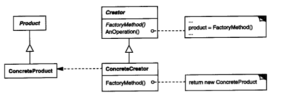
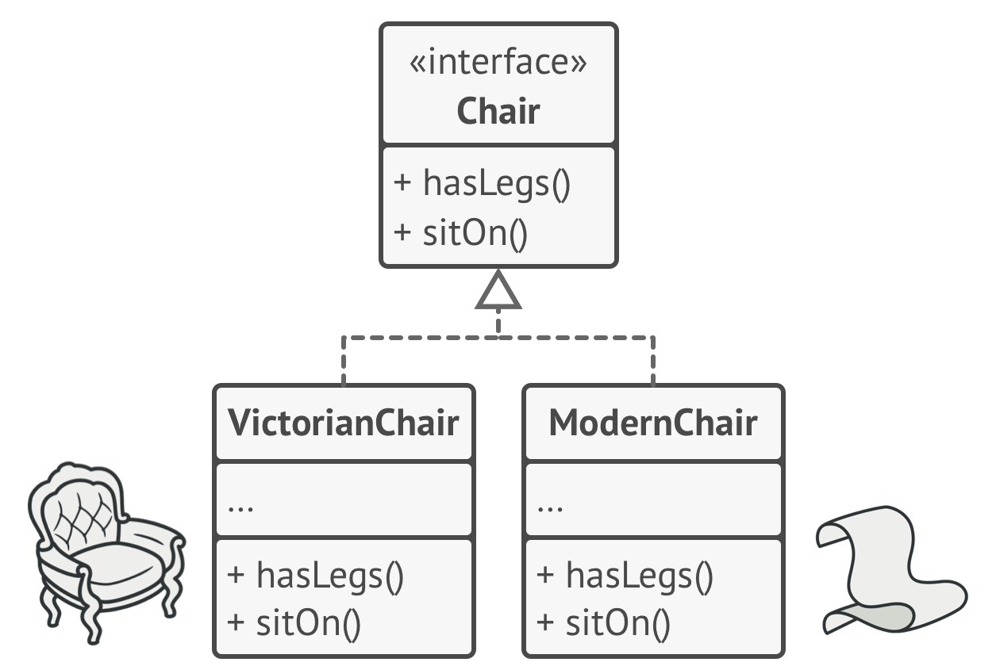
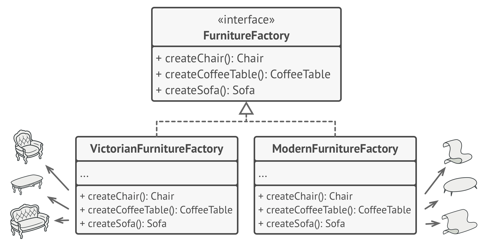
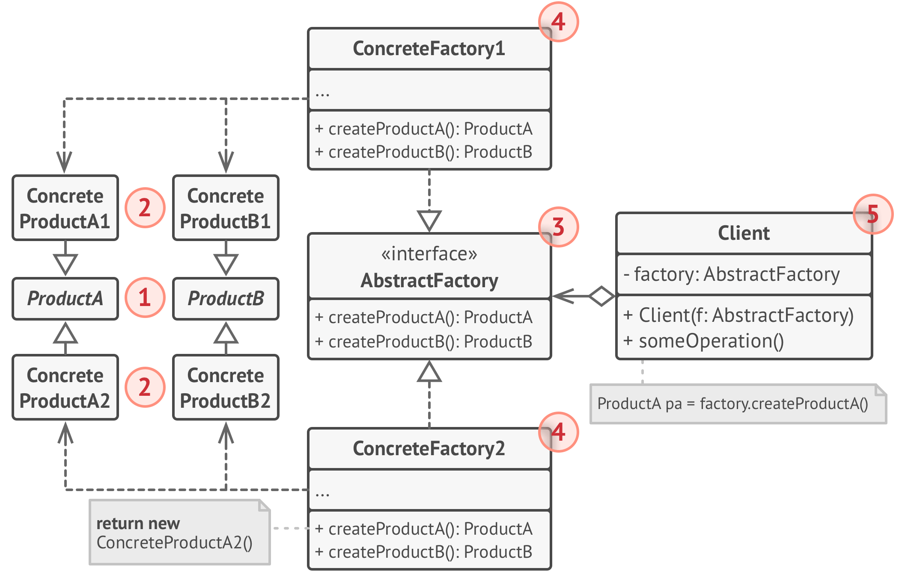
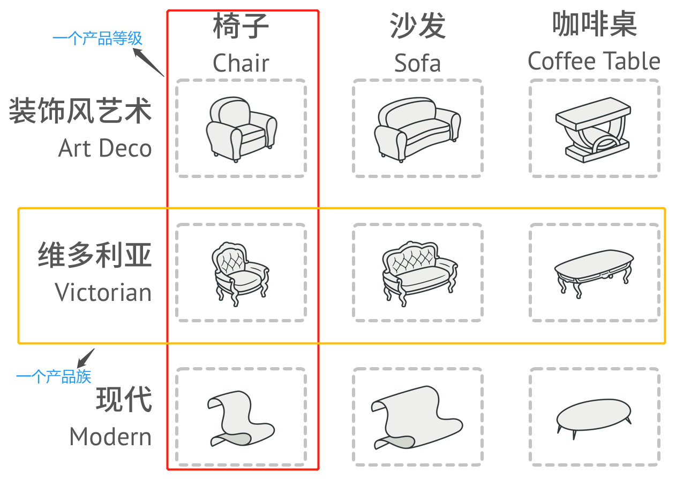
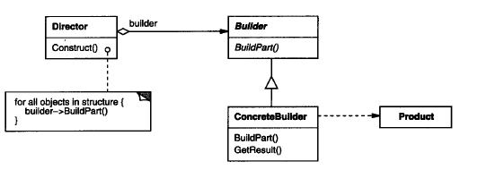
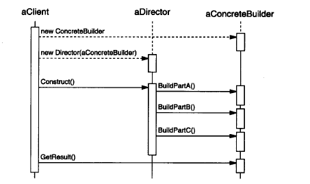

# 创建型模式

​	不使用new运算符直接实例化对象，二建创建逻辑隐藏。

## 工厂方法模式

### 📜意图

简单工厂模式下，添加产品需要修改工厂类，违背了“开闭原则”。

**工厂方法**（Factory Method）为了解决这个问题，将生产不同具体产品的分散到子工厂类，工厂父类负责定义创建产品对象的公共接口。



**实际使用**：（静态）工厂方法可以隐藏创建产品的细节，且不一定每次都会真正创建产品，完全可以返回缓存的产品，从而提升速度并减少内存消耗。 

```java
public final class Integer {
    public static Integer valueOf(int i) {
        if (i >= IntegerCache.low && i <= IntegerCache.high)
            return IntegerCache.cache[i + (-IntegerCache.low)];
        return new Integer(i);
    }
    
}
```

就是将工厂类和实现类合二为一。

### 适用性

​	1）当一个类不知道它所必须创建的对象的类的时候。

​	2）当一个类希望由子类来指定它所创建的对象的时候

​	3）当类将创建对象的职责委托给多个帮忙子类中的某一个，并且你希望那个帮忙子类是代理这一信息局部化

## 抽象工厂方法

### 📜意图

​	抽象工厂模式能创建一系列相关对象，而无需指定其具体类。

​	抽象工厂将一组具有统一主题的单独的工厂封装起来，客户端程序需要创建抽象工厂的具体实现，然后使用抽象工厂作为接口创建这一主题的具体对象。


### 🙃动机

​	客户端的产品是来自于同一`产品族`（风格），而且添加新产品或新风格时不需要修改原有代码。

​	抽象工厂模式的做法：

***Step 01***：将系列中的每件产品明确声明为接口，确保每个产品变体（`产品等级`）都继承/实现产品接口。

<div align="center">



  <div style="color:orange; border-bottom: 1px solid #d9d9d9; display: inline-block; color: #999; padding: 2px;">同一对象的所有变体都必须放置在同一个类层次结构中</div>  
</div>

***Step 02***：处理产品变体；声明`抽象工厂`接口里面包含所有类产品的方法，每个`具体工厂类`**继承**`抽象工厂类`并定义各自产品等级的产品（同类产品）



<div align="center" font-Size="10">
每个具体工厂类都对应一个特定的产品变体</div>

### 📰结构



> 工厂方法与抽象工厂区别：
>
> - 工厂方法解决一个产品多个层级的事情
> - 抽象工厂方法解决多个产品多个层级的事情


产品族与产品等级结构示意图



**抽象工厂模式**：

> 多个抽象产品类，每个抽象产品类可以派生出多个具体产品类。**（一个抽象产品是一个产品等级结构）**
>
> 一个抽象工厂类，可以派生出多个具体工厂类。**（一个具体工厂是一个产品族）**
>
> 每个具体工厂类可以创建多个具体产品类的实例，也就是创建的是一个产品线下的多个产品。  

**工厂方法模式**：

> 一个抽象产品类，可以派生出多个具体产品类。 
>
> 一个抽象工厂类，可以派生出多个具体工厂类。 
>
> 每个具体工厂类只能创建一个具体产品类的实例。

**优点**：当一个产品族中的多个对象被设计成一起工作时，它能保证客户端始终只使用同一个产品族中的对象。

**缺点**：产品族扩展非常困难，要增加一个系列的某一产品，既要在抽象的 Creator 里加代码，又要在具体的里面加代码。

**使用场景**： 1、QQ 换皮肤，一整套一起换。 2、生成不同操作系统的程序。

**注意事项**：产品族难扩展，产品等级易扩展。


## 建造者模式

### 📜意图

>  *将一个复杂对象的构建与它的表示分离，使得同样的构建过程可以创建不同的表示。* 

简单来说就是：用多个工厂创造的对象来组装一个完整的对象。

### 🙃动机

​	你第一次学着做汤，有两种汤，西红柿蛋汤和土豆排骨汤。

汤就是复杂对象，因为不同汤里面的材料是不同的。而做汤这个过程就是建造者（`AbstractBuilder`），所以具体的汤就是`ConcreteBuilder`。

这个时候，管家`Director`来帮你做汤，你只需要知道你做什么汤即（`ConcreteBuilder`），这样你就很简单的做了一道汤。哈哈哈哈😛😛😛

### 📰结构



***Builder***：为创建一个**Product**对象的*各个部件*指定抽象接口。

***ConcreteBuilder***：

+ 实现`Builder`的接口以及构造和装配该产品的各个部件
+ 定义并明确它创建的表示
+ 提供一个使用Builder接口的对象

***Director***：

+ 构造一个使用`Builder`接口的对象

***Product***：

+ 表示被构造的复杂对象
+ 包含定义组成部件的类（对象），包括将这些部件装配成最终产品的接口




### 适用性

​	1）当***创建复杂对象的算法***应该独立于该对象的组成部分以及它们的装配方式时

​	2）当构造过程必须允许被构造的对象有不同表示时


## 原型模式

​	原型模式（**Prototype**）用原型实例指定创建对象的种类，并且通过拷贝这些原型创建新的对象。

用于创建重复的对象，同时又能保证性能。

**应用举例**：细胞复制增殖，绕过构造方法直接利用内存（基因）拷贝对象，这样大大提高了对象的创建效率。

常在大量对象创建或者类初始化消耗多的场景下来利用原型模式做优化。

注意：
[浅拷贝与深拷贝的区别]( https://www.cnblogs.com/always-chang/p/6107437.html )

> 在对含有指针成员的对象进行拷贝时，必须要自己定义拷贝构造函数，使拷贝后的对象指针成员有自己的内存空间，即进行深拷贝，这样就避免了内存泄漏发生。

[浅拷贝和深拷贝的实现方式](https://www.cnblogs.com/shakinghead/p/7651502.html)


## 单例模式
保证一个类仅有一个实例，并且提供一个访问它的全局访问点。
**<font color="red">主要解决</font>**：***一个*全局使用的类**频繁地创建与销毁。

**何时使用**：当您想控制实例数目，节省系统资源的时候。

**如何解决**：判断系统是否已经有这个单例，如果有则返回，如果没有则创建。

**关键代码**：构造函数是私有的。

**应用实例**：

1、一个班级只有一个班主任。

2、Windows 是多进程多线程的，在操作一个文件的时候，就不可避免地出现多个进程或线程同时操作一个文件的现象，所以所有文件的处理必须通过唯一的实例来进行。

3、一些设备管理器常常设计为单例模式，比如一个电脑有两台打印机，在输出的时候就要处理不能两台打印机打印同一个文件。

<font color="red">**注意事项**</font>：`getInstance()` 方法中需要使用同步锁 `synchronized (Singleton.class)` 防止多线程同时进入造成 instance 被多次实例化。

### 单例模式的几种实现方式：

#### 1、懒汉式

##### 线程不安全

 这种方式是最基本的实现方式，这种实现最大的问题就是不支持多线程。因为没有加锁 synchronized，所以严格意义上它并不算单例模式。 

```java
public class Singleton {  
    private static Singleton instance;  
    private Singleton (){}  
  
    public static Singleton getInstance() {  
     //有则不初始化，复用
    if (instance == null) {  
        instance = new Singleton();  
    }  
    return instance;  
    }  
}
```

##### 线程安全

 这种方式具备很好的 lazy loading，能够在多线程中很好的工作，但是，效率很低，99% 情况下不需要同步。 

**优点**：第一次调用才初始化，避免内存浪费。
**缺点**：必须加锁 synchronized 才能保证单例，但加锁会影响效率。 

```java
public class Singleton {  
    private static Singleton instance;  
    private Singleton (){}  
    //将getInstance（）加同步锁
    public static synchronized Singleton getInstance() {  
    if (instance == null) {  
        instance = new Singleton();  
    }  
    return instance;  
    }  
}
```

#### 2、饿汉式

 这种方式比较常用，但容易产生垃圾对象。
**优点**：没有加锁，执行效率会提高。
**缺点**：类加载时就初始化，浪费内存。 

```java
public class Singleton {  
    private static Singleton instance = new Singleton();  
    private Singleton (){}  
    public static Singleton getInstance() {  
    return instance;  
    }  
}
```

#### 3、双检锁/双重校验锁

双检锁，DCL，即 double-checked locking，这种方式在**多线程**情况下能保持高性能。

```java
public class Singleton{
	//被volatile修饰的变量能够保证每个线程能够获取该变量的最新值，
	//从而避免出现数据脏读的现象。
	private volatile static Singleton singleton;
	private Signleton(){}
     public static Singleton getSingleton() {  
    if (singleton == null) {  
        synchronized (Singleton.class) {  
            if (singleton == null) {  
                singleton = new Singleton();  
            }  
        }  
    }  
    return singleton;  
  }  	
}
```

#### 4、静态内部类/登记式

 这种方式能达到双检锁方式一样的功效，但实现更简单。对静态域使用延迟初始化，应使用这种方式而不是双检锁方式。这种方式只适用于静态域的情况，双检锁方式可在实例域需要延迟初始化时使用。 

```java
public class Singleton {  
    private static class SingletonHolder {  
    private static final Singleton INSTANCE = new Singleton();  
    }  
    private Singleton (){}  
    public static final Singleton getInstance() {  
    return SingletonHolder.INSTANCE;  
    }  
}
```

#### 5、枚举

 实现单例模式的**最佳**方法。它更简洁，自动支持序列化机制，绝对防止多次实例化。 

```java
public enum Singleton {  
    INSTANCE;  
    public void whateverMethod() {  
    }  
}
```

### 总结：

一般情况下，建议使用饿汉方式。要是明确实现lazy loading效果，才会使用第4种静态内部类方式。如果设计反序列化创建对象时，用第5种枚举方式。特殊情况下，为了安全不考虑速度，用双检锁。


# 创建型模式的总结

​	用一个系统创建的那些对象的类对系统进行参数化的两种常用方法：

+ 生成创建对象的类的子类，即***Factory Method***模式

+ 对象复合
  + 定义一个对象（`管理者`/`工厂对象`）负责明确产品对象的类，并且将它作为该客户端的参数。
    + ***Abstract Factory***由工厂对象产生多个对象的对象
    + ***Builder***由这个工厂对象使用一个相对复杂的协议（把创建过程封装），逐步创建一个复杂产品
    + ***Prototype***由该工厂对象（原型）通过拷贝原型来创建产品对象