## 结构型模式

主要涉及如何组合各种对象以便于获得更好，更灵活的结构。这里充分说明了组合/聚合的使用，比继承更好。

### 适配器模式

#### 📜意图

​	将一个类的接口转换为客户希望的另外一个接口。`Adapter`模式使得原来由于不兼容而不能一起工作的类可以一起工作。

#### 📰结构

​	***类适配器***使用多重继承对一个接口和另一个接口进行匹配

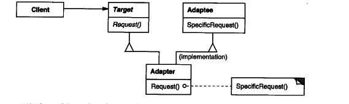

​	***对象适配器***依赖于对象组合

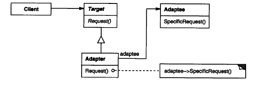

***Target***：定义Client使用的与特定领域相关的接口

***Adaptee***：定义一个以及存在的接口，这个接口需要适配

***Adapter***：对Adaptee的接口与Target接口适配

> Client在Adapter实例上调用一些操作，接着适配器调用Adaptee的操作实现这个请求。


项目代码：[让方钉适应圆孔](adapter/)


### 桥接模式

#### 📜意图

​	将一大类或一系列紧密相关的类拆分为**抽象**和**实现**两个独立的层次结构，从而开发时分别使用。

1. **抽象部分** （Abstraction） 提供高层控制逻辑， 依赖于完成底层实际工作的实现对象。

2. **实现部分** （Implementation） 为所有具体实现声明通用接口。 抽象部分仅能通过在这里声明的方法与实现对象交互。

   

#### 📰结构

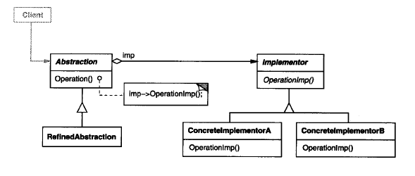

+ ***Abstraction***（抽象层）

  + 定义抽象类的接口
  + 维护一个指向`Implementor`类型的引用

+ ***RefinedAbstrction***

  扩充由`Abstraction`d定义的接口

+ ***Implementor***（实现层）

  定义实现类的接口，该接口不一定要与`Abstraction`的接口完全一致，`Implementor`提供基本操作
  
  

#### 😍优点

​	1、分离接口及其实现部分，可在运行时刻进行配置

​	2、提高可扩充性，可独立对`Abstraction`和`Implementor`层次结构进行扩充

​	3、实现细节对客户透明

  

项目代码：[设备和远程控制之间的桥接](bridge/)


### 组合模式

#### 📜意图

​	将对象组合成树状结构，并且像独立对象一样使用它们。


#### 📰结构

 组合模式包含如下角色：
**Component**: 抽象构件

+ 为组合中的对象声明接口
+ 在适当情况下，实现所有类共有接口的缺省行为。
+ 声明一个接口`Component`用于访问和管理子组件

**Leaf**: 叶子构件

+ 定义操作方法

**Composite**: 容器构件

+ 定义有子部件的那些部件的行为
+ 存储子部件
+ 在Component接口中实现与子部件相关的操作。

**Client**: 客户类 

+ 通过Component接口操纵组合部件的对象

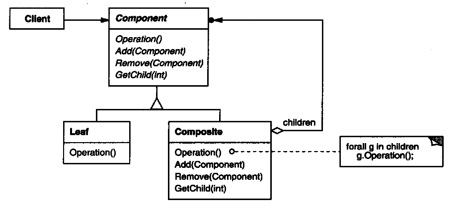

它定义了如何将容器对象和叶子对象进行递归组合，使得客户在使用过程中无需区分。

​	关键之处：叶子对象和组合对象实现相同的接口`Component`。


#### 适用性

+ 想表示对象的部分-整体层次结构
+ 希望用户忽略组合对象与单个对象的不同，用户将统一地使用组合结构中所有对象


### 装饰模式

#### 📜意图

​	通过继承和组合的方式来给对象添加行为，虽然使用继承能够很好拥有父类的行为，但是它存在几个缺陷：

一、对象之间关系很复杂的话，系统变得复杂不利于维护

二、容易产生"类爆炸现象"

> 指在实现一个功能时，类本来可以不用这么多，但是却设计成这么多，使得维护成本过高，明显高于设计的效用 

三、只能是静态添加


​	而装饰者模式就是为了解决这个问题的，它可以动态地将责任附加到对象上。

#### 📰结构

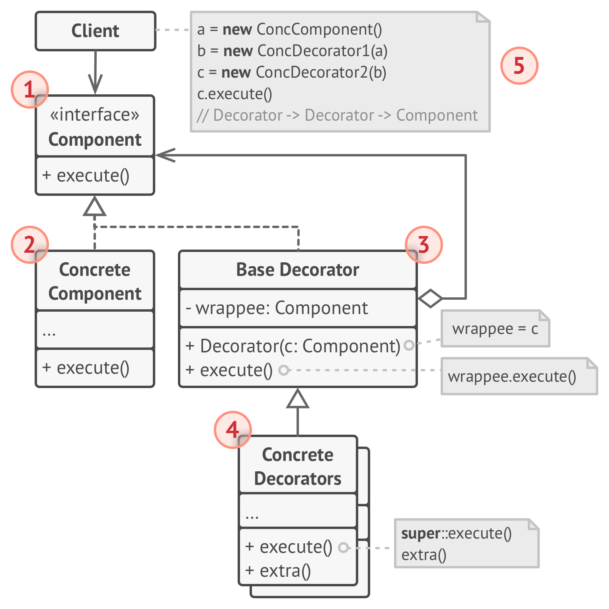

装饰模式包含如下角色：

1、**部件**（Component）声明封装器和被封装对象的公用接口

2、**具体部件**（Concrete Component）类是被封装对象所属的类。定义了基础行为，但装饰类可以改变这些行为。

3、**基础装饰**（Base Decorator）类拥有一个指向被封装对象的引用成员变量。该变量的类型应当被声明为通用部件接口，这样它就可以引用具体的部件和装饰。

4、**具体装饰类**（Concrete Decorators）定义了可动态添加到部件的额外行为。具体装饰类会重写装饰基类方法，并在调用父类方法之前或之后进行额外的行为。

5、**客户端**（Client）可以使用多层装饰来封装部件，只要它能使用通用接口与所有对象互动即可。


#### 适用性

+ 如果希望在无需修改代码的情况下即可使用对象，且希望在运行时为对象新增额外的行为
+ 如果用继承来扩展对象行为的方案难以实现或者根本不行（如用final限制类）


代码实例：[编码和压缩装饰](./decorator)

第一个封装器负责加密和解密数据，而第二个则负责压缩和解压缩数据

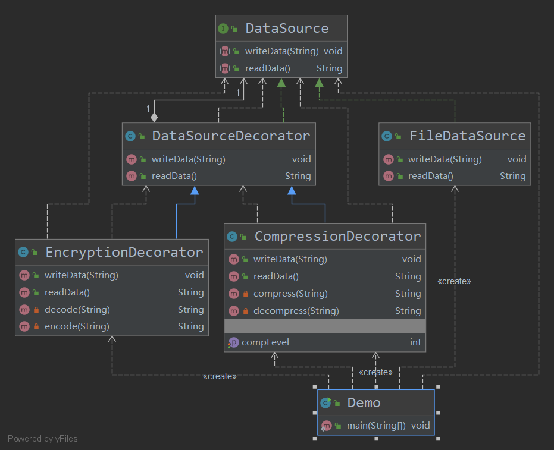


### 外观模式

#### 📜意图

​	用户只需要跟外观角色交互，用户与子系统之间的复杂关系由外观角色来实现。

**真实世界类比**

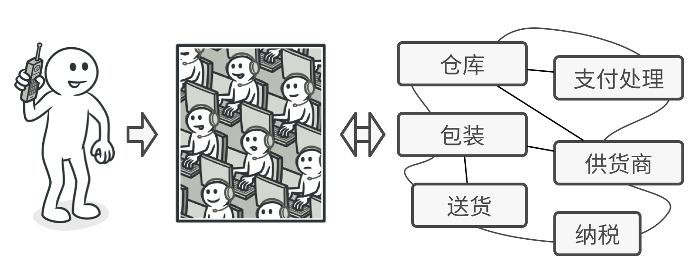

<div align="center">电话购物</div>
​	你只需要打一个电话给接线员（Facade)，由接线员为你提供一个同购物系统、支付网关和各种送货服务进行互动的简单语音接口。

#### 📰结构

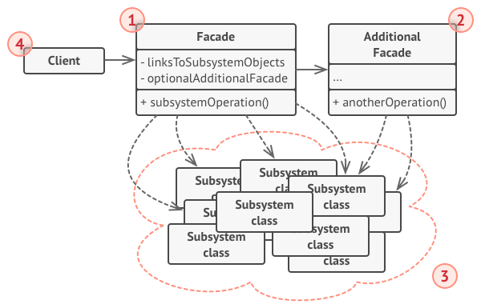

1. **外观** （Facade） 提供了一种访问特定子系统功能的便捷方式， 其了解如何重定向客户端请求， 知晓如何操作一切活动部件。

2. 创建**附加外观** （Additional Facade） 类可以避免多种不相关的功能污染单一外观， 使其变成又一个复杂结构。 客户端和其他外观都可使用附加外观。

3. **复杂子系统** （Complex Subsystem） 由数十个不同对象构成。 如果要用这些对象完成有意义的工作， 你必须深入了解子系统的实现细节， 比如按照正确顺序初始化对象和为其提供正确格式的数据。

   子系统类不会意识到外观的存在， 它们在系统内运作并且相互之间可直接进行交互。

4. **客户端** （Client） 使用外观代替对子系统对象的直接调用。

#### 适用性

+ **如果你需要一个指向复杂子系统的直接接口， 且该接口的功能有限，则可以使用外观模式。** 

+ **如果需要将子系统组织为多层结构，可以使用外观。** 

  >  创建外观来定义子系统中各层次的入口。 你可以要求子系统仅使用外观来进行交互， 以减少子系统之间的耦合。 


  代码实例：[复杂适配转换库的简单接口](./facade)

​	使用外观模式简化复杂视频转换框架所进行的沟通工作。

​	外观提供了仅包含一个方法的类， 可用于处理对框架中所需类的配置与以正确格式获取结果的复杂工作。 

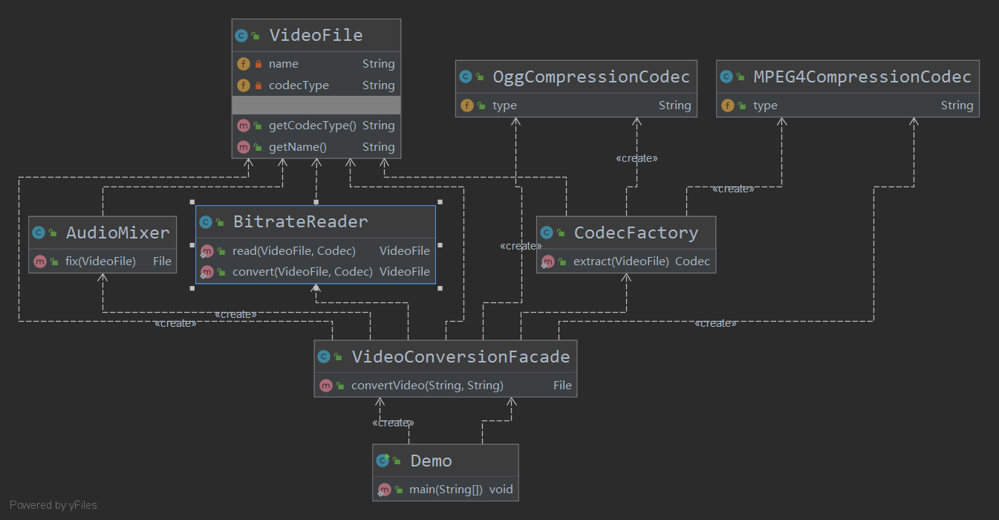


### 享元模式

#### 📜意图

享元模式通过***共享技术***实现相同或相似对象的重用。

核心思想：如果一个的对象被创建了，那么就不应该反复创建相同的实例了，直接回调一个共享的实例即可，这样既节省内存，又可以减少创建对象的过程。

***模式分析***：

- **内部状态**：可以共享的相同内容，其他对象只能读取但不能修改其数值；
- **外部状态**：需要外部环境来设置的不能共享的内容称为外部状态；

享元模式需要配合工厂模式，创建一个享元工厂来负责维护一个**享元池**（Flyweight Pool）用来存储具有相同内部状态的享元对象。

 由于享元对象可在不同的情景中使用， 你必须确保其状态不能被修改。 享元类的状态只能由构造函数的参数进行一次性初始化， 它不能对其他对象公开其设置器或公有成员变量。 

#### 📰结构

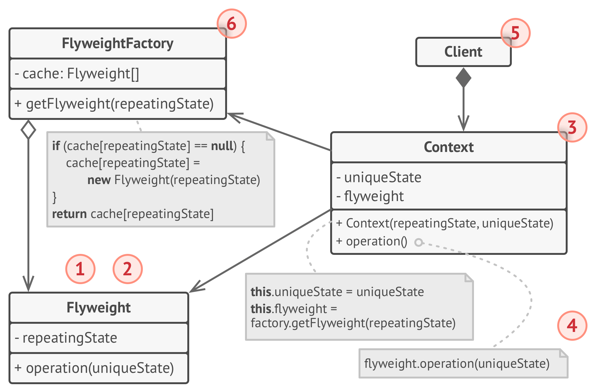


1. 享元模式只是一种优化。 在应用该模式之前， 你要确定程序中存在与大量类似对象同时占用内存相关的内存消耗问题， 并且确保该问题无法使用其他更好的方式来解决。

2. **享元** （Flyweight） 类包含原始对象中部分能在多个对象中共享的状态。 同一享元对象可在许多不同情景中使用。 享元中存储的状态被称为 “内在状态”。 传递给享元方法的状态被称为 “外在状态”。

3. **情景** （Context） 类包含原始对象中各不相同的外在状态。 情景与享元对象组合在一起就能表示原始对象的全部状态。

4. 通常情况下， 原始对象的行为会保留在享元类中。 因此调用享元方法必须提供部分外在状态作为参数。 但你也可将行为移动到情景类中， 然后将连入的享元作为单纯的数据对象。

5. **客户端** （Client） 负责计算或存储享元的外在状态。 在客户端看来， 享元是一种可在运行时进行配置的模板对象， 具体的配置方式为向其方法中传入一些情景数据参数。

6. **享元工厂** （Flyweight Factory） 会对已有享元的缓存池进行管理。 有了工厂后， 客户端就无需直接创建享元， 它们只需调用工厂并向其传递目标享元的一些内在状态即可。 工厂会根据参数在之前已创建的享元中进行查找， 如果找到满足条件的享元就将其返回； 如果没有找到就根据参数新建享元。

   

#### 适用性

 🐛**仅在程序必须支持大量对象且没有足够的内存容量时使用享元模式。**

 🐸应用该模式所获的收益大小取决于使用它的方式和情景。 它在下列情况中最有效：

- 程序需要生成数量巨大的相似对象
- 这将耗尽目标设备的所有内存
- 对象中包含可抽取且能在多个对象间共享的重复状态。


实例代码：[渲染一片森林](./flyweight)

本例中， 我们将渲染一片森林 （1,000,000 棵树）！ 每棵树都由包含一些状态的对象来表示 （坐标和纹理等）。 尽管程序能够完成其主要工作， 但很显然它需要消耗大量内存。

原因很简单： 太多树对象包含重复数据 （名称、 纹理和颜色）。 因此我们可用享元模式来将这些数值存储在单独的享元对象中 （ `Tree­Type` 类）。 现在我们不再将相同数据（**位置**）存储在数千个 `Tree` 对象中， 而是使用一组特殊的数值来引用其中一个享元对象。

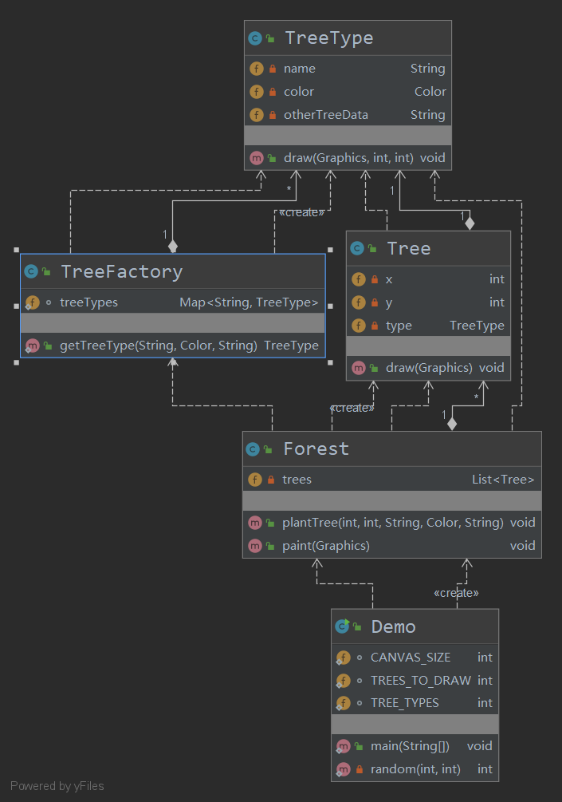

***享元工厂核心代码***

```java
public class FlyweightFactory{
    //使用map存储内部状态的对象组
	private HashMap flyweights = new HashMap();
    
    //如果有则复用，无则新建
    public Flyweight getFlyWeight(String key){
        
        if(flyweights.containsKey(key)){
            return (Flyweight)flyweights.get(key);
        }else{
            Flyweight fw = new ConcreteFlyweight();
            flyweights.put(key,fw);
        }
    }
}
```


### 代理模式

#### 📜意图

​	代理对象可以控制对原对象的访问，并允许在将请求提交给对象前后进行一些处理。

**现实举例**：

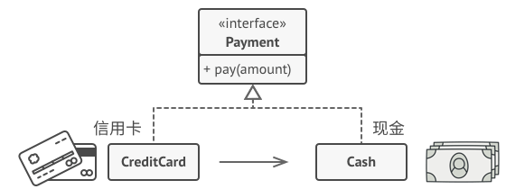

​	现实生活中常用信用卡来代替现金的使用，而且在使用现金时，还有保护机制防止被被人盗用，这是现金没有的功能。信用卡是在现金的能用基础上拓展的功能。

#### 📰结构

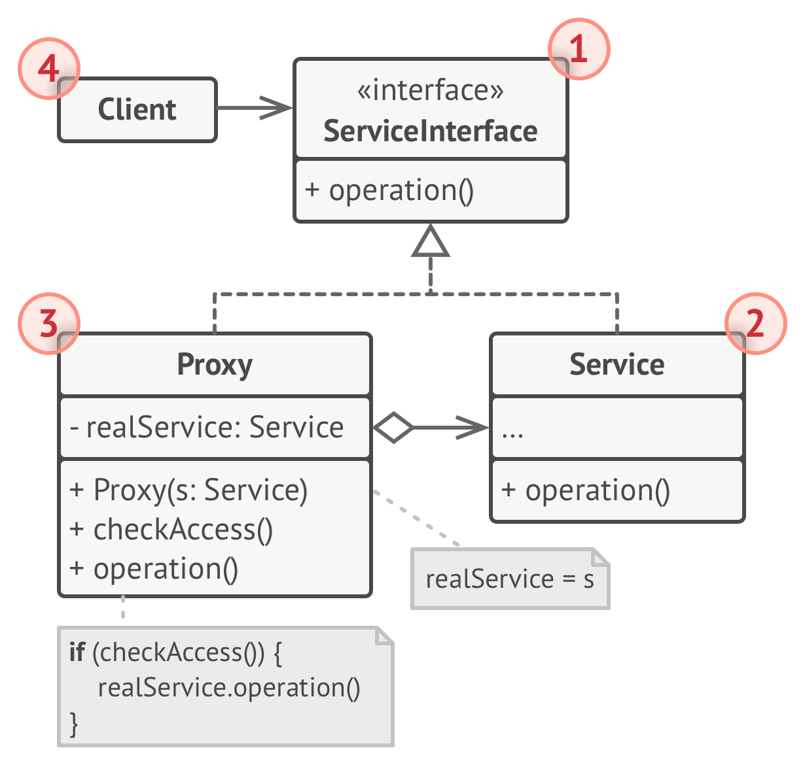

1. **服务接口** （Service Interface） 声明了服务接口。 代理必须遵循该接口才能伪装成服务对象。
2. **服务** （Service） 类提供了一些实用的业务逻辑。
3. **代理** （Proxy） 类包含一个指向服务对象的引用成员变量。 代理完成其任务 （例如延迟初始化、 记录日志、 访问控制和缓存等） 后会将请求传递给服务对象。 通常情况下， 代理会对其服务对象的整个生命周期进行管理。
4. **客户端** （Client） 能通过同一接口与服务或代理进行交互， 所以你可在一切需要服务对象的代码中使用代理。


#### 适用性

🐛 **延迟初始化 （虚拟代理）。 如果你有一个偶尔使用的重量级服务对象， 一直保持该对象运行会消耗系统资源时， 可使用代理模式。**

🐸 你无需在程序启动时就创建该对象， 可将对象的初始化延迟到真正有需要的时候（比如`JDBC`连接）。

😎 **访问控制 （保护代理）。 如果你只希望特定客户端使用服务对象， 这里的对象可以是操作系统中非常重要的部分， 而客户端则是各种已启动的程序 （包括恶意程序）， 此时可使用代理模式。**

🤓 代理可仅在客户端凭据满足要求时将请求传递给服务对象。

😎 **本地执行远程服务 （远程代理）。 适用于服务对象位于远程服务器上的情形。**

🤓 在这种情形中， 代理通过网络传递客户端请求， 负责处理所有与网络相关的复杂细节。

😎 **记录日志请求 （日志记录代理）。 适用于当你需要保存对于服务对象的请求历史记录时。 代理可以在向服务传递请求前进行记录。**

🤓 缓存请求结果 （缓存代理）。 适用于需要缓存客户请求结果并对缓存生命周期进行管理时， 特别是当返回结果的体积非常大时。

- 代理可对重复请求所需的相同结果进行缓存， 还可使用请求参数作为索引缓存的键值。

😎 **智能引用。 可在没有客户端使用某个重量级对象时立即销毁该对象。**

🤓 代理会将所有获取了指向服务对象或其结果的客户端记录在案。 代理会时不时地遍历各个客户端， 检查它们是否仍在运行。 如果相应的客户端列表为空， 代理就会销毁该服务对象， 释放底层系统资源。

代理还可以记录客户端是否修改了服务对象。 其他客户端还可以复用未修改的对象。


实例代码：[虚拟代理](./proxy)

在用到需要的照片时就加载

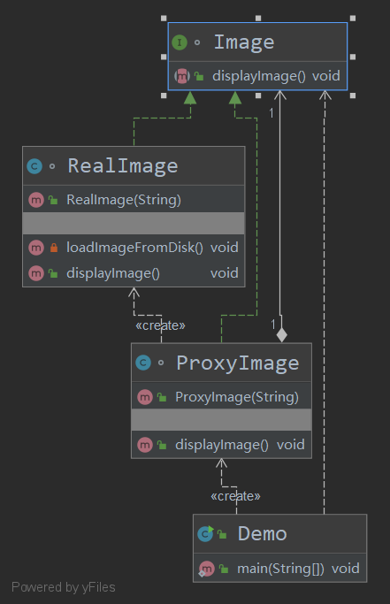

